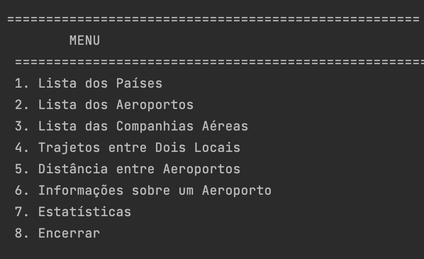
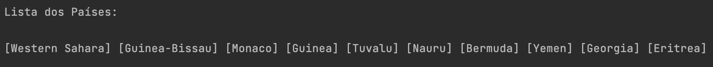
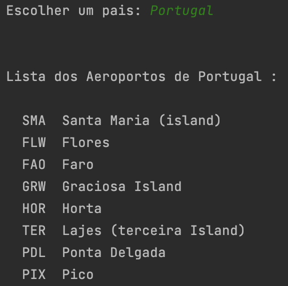
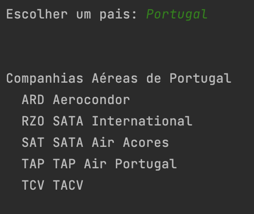
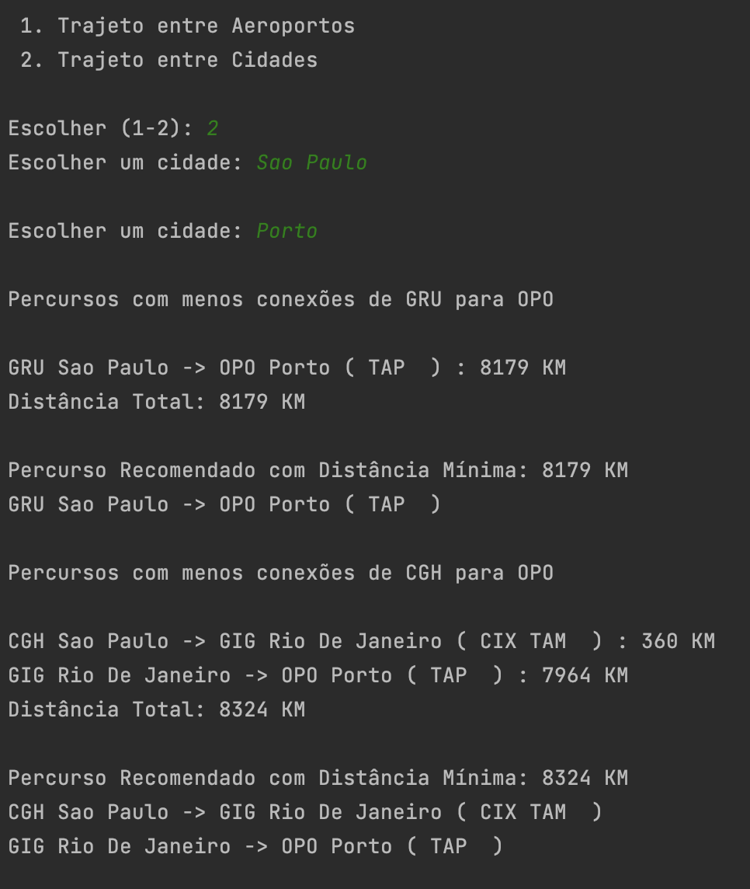
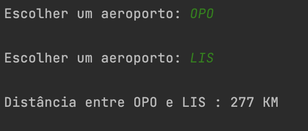
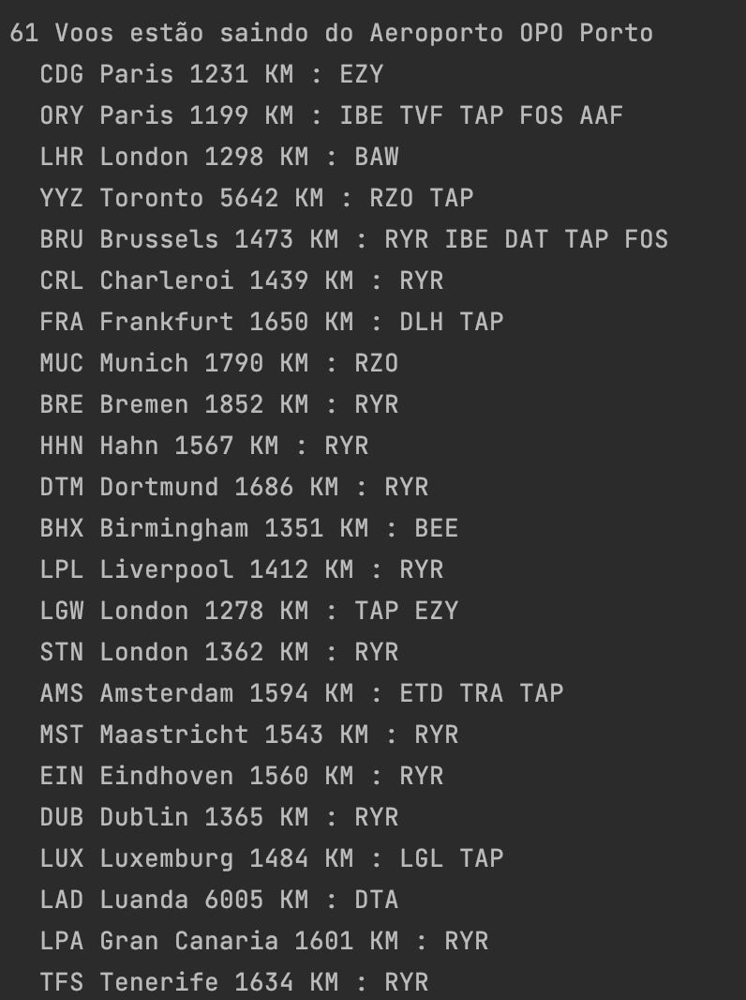
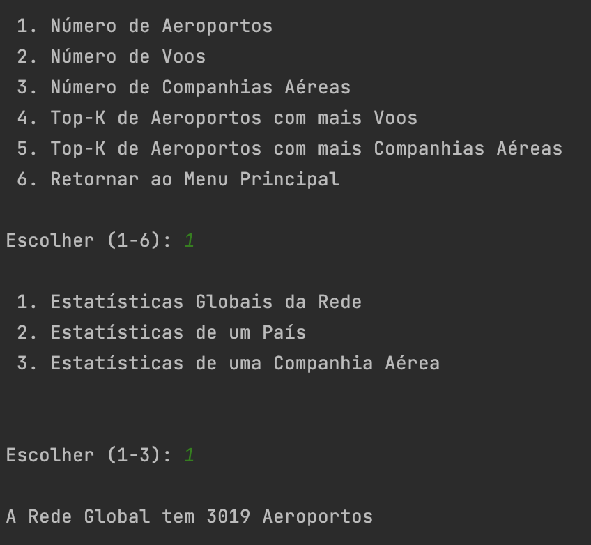

# Algorithms and Data Structures

Development of a system that provides assistance to users who want to navigate and utilize the global network of airline flights. The system will leverage graph theory to model the worldwide airline network, with airports representing nodes and flights representing edges. By using graph algorithms, the system will perform various operations to retrieve essential information, such as optimal flight routes, connecting flights, shortest paths, and availability across different airlines.

## Implemented Features

### Main Menu

### List of Countries

### List of Airports

### List of Airlines

### Routes Between Two Locations

### Distance Between Airports

### Information About an Airport

### Statistics

